  

# Agrícola

---

SISTEMA: **ERP – Sapiens**  
MÓDULO: **AGRICOLA**  
VERSÃO ATUAL: **5.8.9.13**   
VERSÃO TESTE: **5.8.9.23**   
RESPONSÁVEL: **IRENE GRISOSTE**  
CRIADO EM: **26/06/2017**

---

### Entendimentos

#### Introdução
	
Esse documento tem como objetivo homologar as rotinas do sistema Sapiens na versão **5.8.9.13** que tem previsão de atualização em **25/03/2017**.

#### Objetivo

Identificar possíveis falhas na versão.

#### Conclusão

Identificar os erros encontrados.

#### Exclusões específicas
	
Não serão testadas todas as rotinas do sistema, comente as principais.

#### Atividades e Estratégias de Homologação

Os testes vão ser realizados em 14/03/2017

#### Fatores de Sucesso da Homologação

Todas as principais rotinas testadas e homologadas para a atualização.
 

## **F420GOC_SCOC - Suprimentos / Gestão de Compras / Ordens de Compra / Agrupada** 

### Notas da Versão 5.8.9.18

!!! note ""  
	**Erro no processamento da ordem de compra**  

	**Problema:** ao gerar uma ordem de compra via tela Ordem de Compra Agrupada com o identificador de regra **CPR-420OCPAO01** ativo, ocorria um erro de aprovação multinível caso este identificador de regra retornasse algum erro na sua primeira execução do processar por conta do erro do identificador.  
	**Correção efetuada:** ajustamos o sistema para que caso o identificador de regra **CPR-420OCPAO01** retorne algum erro no seu primeiro processo de OC, não ocorra um erro de aprovação multinível nas próximas execuções do processar.

### Teste

Campo da Tela | Valor  
 - | - 
N° DA ORDEM DE COMPRA | 33.679
EMISSAO DA OC. | AUTOMOTIVO 14/03/2017
TRANSAÇÃO DO PRODUTO |	90410 
FORNECEDOR | 	668
PEDIDO FORNECEDOR |	123
MOEDA |	03
SAFRA |	2016/2017
OBS: |	COMPRA DE DEFENSIVO PARA FAZ. RAFAELA 

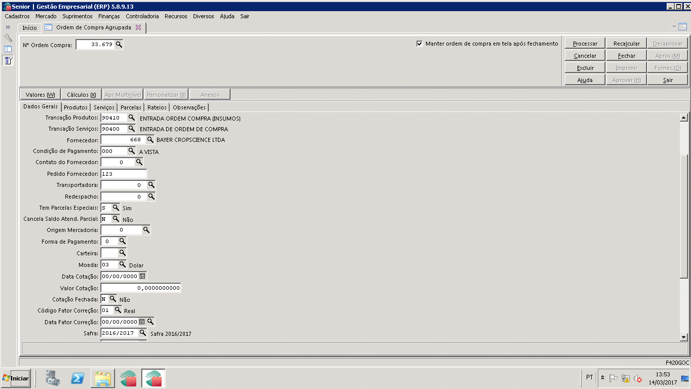

Campo da Tela |	Valor
 - | -
TRANSAÇÃO |	90410
PRODUTO	| 00386
QTDE PEDIDA	| 10.000
PREÇO UNITARIO	| 8,79
DEP.	| 003 (INSUMOS RAFAELA)
CENTRO DE CUSTO |	450

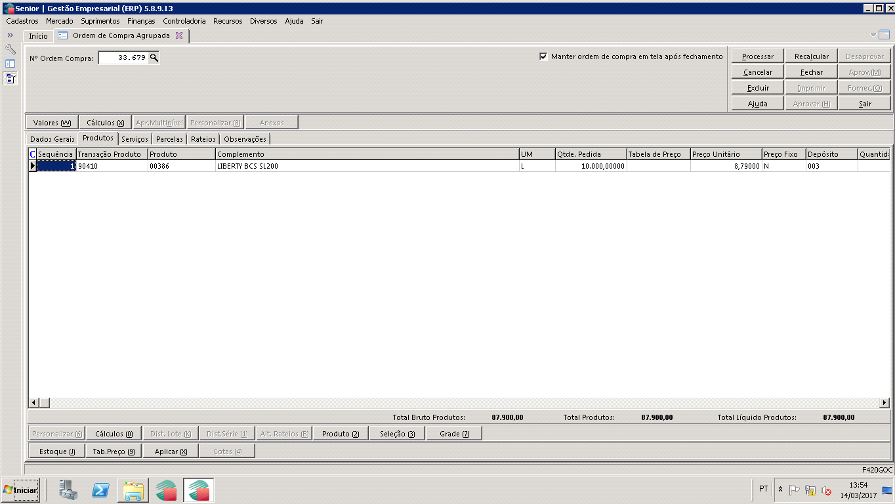

Campo da Tela |	Valor
 - | -
PARCELA |	30/10/2017

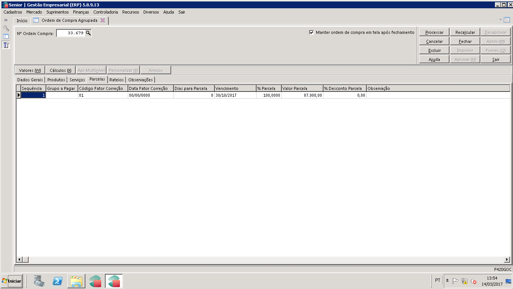

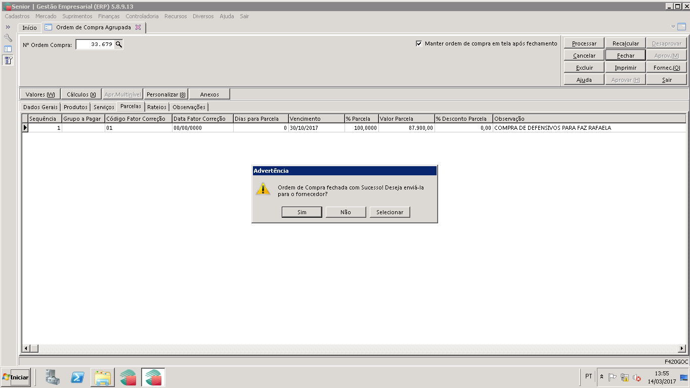

**Ordem de compra com desconto em dólar.**  
Ordem de compra gerada com desconto em dólar, com valor **BRUTO E VALOR LIQUIDO**. 

### Relatório

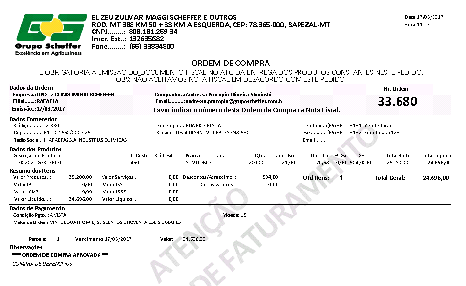

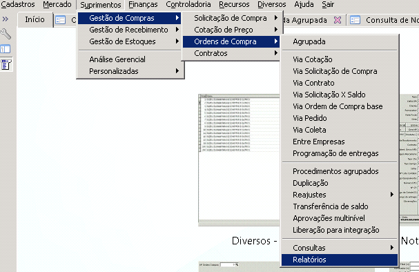

Este relatório 203 não aparece o valor líquido da ordem de compra. 
Isso atrapalha nos controles que usamos fazer em cima deste relatório. 

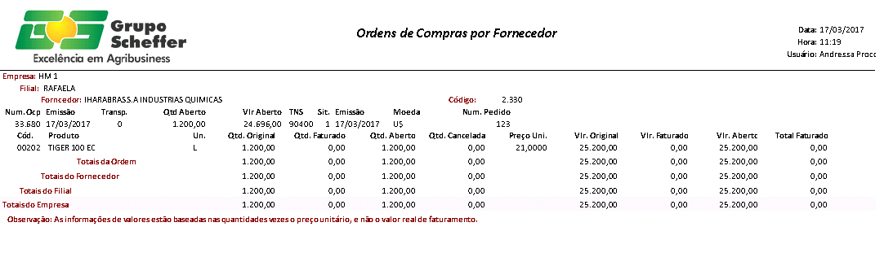

Valor antes do faturamento da ordem de compra no financeiro – valor líquido da ordem da ordem de compra. 

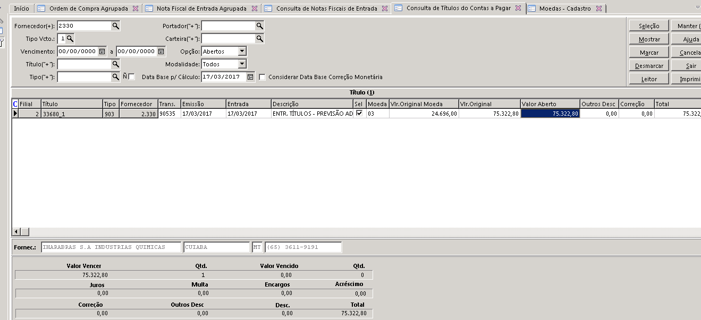

Faturamento da nf, no ato do faturamento temos que alterar o valor unitário de acordo com o documento fiscal.

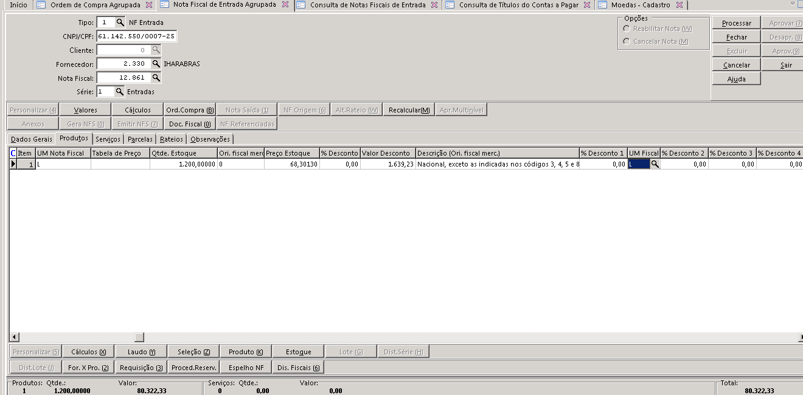

Na tela de títulos após o faturamento ele aparece o valor bruto da ordem de compra, e não o valor negociado da moeda dólar. 

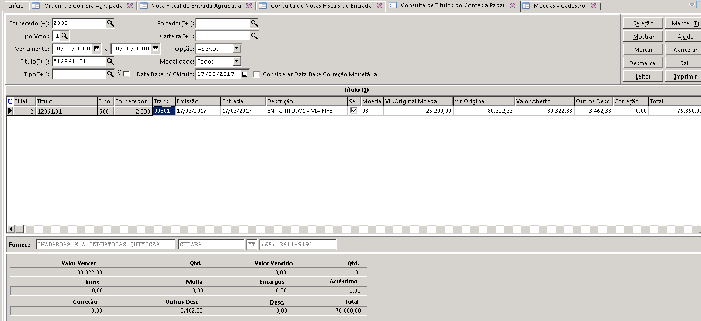 
 
## **F440GNE_SRNF - Suprimentos / Gestão de Recebimento / Notas Fiscais de Entrada / Agrupada**

### Notas da Versão 5.8.8.67

!!! note ""  
	**Chave da nota fiscal eletrônica de produtor**

	O produtor pessoa física ou jurídica pode emitir uma nota fiscal eletrônica do produtor, essa nota fiscal poderá ser informada no sistema, quando o processo gera uma nota fiscal do tipo 6. O campo que receberá essa informação é o *Chave NPF-e*, implementado nas telas de **Manutenção de Ticket, Compras - Controle de Entradas e Saídas (Via Contrato de Classificação)**, na guia *Fornecedores Participantes*.
	No web service **com.senior.g5.co.mcm.cpr.pesagemviabalancacontrato**, porta *GravaPesagemEntrada 2* inserimos os seguintes campos:  

	•	**ChvNfp**: Chave NFP-e  
	•	**SnfPro**: Série da nota do produtor  
	•	**TnsPro**: Transação de produto  

	Disponibilizamos a subtela *Documento Fiscal Produtor Rural (F440RNP)*, acessada pelo botão *NFP Referenciada* da tela de **Nota Fiscal de Entrada Agrupada**. Esta subtela permite alterar informações da *Nota do Produtor*. Assim, caso haja rejeição da nota, será possível alterar os dados.

	Se houver preenchimento na *Chave NPF-e*, no xml gerado da nota a tag **<refNFe>** será preenchida com *NFP-e*.

	**Novo identificador de regras CPR-440PRMED02**

	Criamos o identificador de regras **CPR-440PRMED02** que tem por objetivo permitir utilizar o preço médio do produto, informado via regra, em vez do valor líquido do item na valorização dos produtos na tela **Valorização do Produto (F440VPR)/**.

	**O sistema não atualizava a transação de produto e/ou serviço e natureza da operação**  

	**Problema:** na tela **Nota Fiscal de Entrada Agrupada**, ao dar entrada em notas do tipo 2, 3 e 10 utilizando o parâmetro global *UsaEntOri* ativo ao alterar a origem da mercadoria, para um endereço de fora do estado da filial, o sistema não atualizava a transação de produto e/ou serviço, assim como também não atualizava a natureza da operação.  
	**Correção efetuada:** ajustamos o sistema para que ao alterar a origem da mercadoria para um endereço de fora do estado da filial, o sistema faça a busca da transação e natureza da operação correspondentes para aquele determinado fornecedor.

	**Mensagem de erro ao informar uma nota de frete**  

	**Problema:** no vínculo de uma nota de frete com uma nota de origem através do botão *NF Origem (6)*, onde a nota de frete possuía o estado para cálculo do ICMS como PR e o fornecedor realizava o cálculo em outro estado, como SC, retornava uma mensagem de recálculo da nota: **O Estado PR para o cálculo da alíquota de ICMS do conhecimento de frete difere do Estado SC da Nota Fiscal de Origem 1988. Deseja recalcular a Nota Fiscal?.**  
	O sistema ignorava que o estado para o cálculo do ICMS da nota de origem era PR e apresentava o número da nota de frete em vez do número da nota de origem. Isso ocorria quando o parâmetro global *UsaEntOri* estava como *S-Sim*, pois existia uma mudança na nota fiscal por conta deste parâmetro (busca dos dados da origem de mercadoria) que não verificava esta mudança.  
	**Correção efetuada:** ajustamos a mensagem do recálculo do ICMS para que os estados utilizados para o cálculo do ICMS sejam os da nota de frete e da nota de origem quando o parâmetro global *UsaEntOri* for *S-Sim*, quando esse parâmetro for *N-Não*, o estado utilizado continuará a ser do fornecedor para a nota de entrada e do cliente para a nota de saída.

	Ajustamos o sistema também, para apresentar o número da nota de origem em vez da nota de frete na mensagem de recálculo.

	**Campo Código Especificador da Substituição Tributária não era carregado**  

	**Problema:** ao vincular uma ordem de compra a uma nota fiscal de entrada na tela **Nota Fiscal de Entrada Agrupada**, o campo *Código Especificador da Substituição Tributária* dos itens da nota fiscal de entrada não era carregado.
	**Correção efetuada:** ajustamos o campo *Código Especificador da Substituição Tributária* para que carregue as parametrizações do sistema, ao vincular uma ordem de compra a uma nota fiscal de entrada. Diferente da nota fiscal de saída, o campo *Código Especificador da Substituição Tributária* não está presente na tabela dos itens da ordem de compra, portanto não terá herança.

	**Erro ao realizar o lançamento de uma nota fiscal de entrada a partir de uma ordem de compra que possuía produtos KIT**  

	**Problema:** ao realizar o lançamento de uma nota fiscal de entrada a partir de uma ordem de compra que possuía produtos KIT, caso a transação do item de produto da nota fiscal não tinha integração com estoque, o sistema não permitia mais reabilitação e cancelamento dessa nota, apresentando a mensagem *Não foi possível localizar os Movimentos de Estoque gerados pela Nota Fiscal* (Produtos KIT da Ordem de Compra), porém no fechamento da nota não era validada essa informação.  
	**Correção efetuada:** ajustamos a rotina de fechamento da nota fiscal de entrada, apresentando a seguinte mensagem ao tentar fechar uma nota fiscal de entrada com produto KIT de ordem de compra, em que a transação do item de produto esteja sem integração com estoque: Ordem de Compra possui Produtos KIT. Necessário que a transação do item de produto da *Nota Fiscal* tenha integração com Estoque!.

	**Era possível alterar o campo *Produto* do primeiro registro na guia *Produtos***  

	**Problema:** quando gerada uma nota fiscal vinculada a uma ordem de compra ou uma nota fiscal de venda, ao consulta-la na tela **Nota Fiscal Agrupada** era possível alterar o campo *Produto* do primeiro registro na guia *Produtos*.  
	**Correção efetuada:** ajustamos a tela **Nota Fiscal Agrupada** para que caso a nota fiscal possua um vínculo com uma ordem de compra ou uma nota fiscal de venda, não seja possível alterar o registro do primeiro produto na guia *Produtos*.

### Notas da Versão 5.8.8.68

!!! note ""
	**Mensagem de erro na validação do SPED Contribuições** 

	**Problema:** na validação do *SPED Contribuições* ocorria a seguinte mensagem no registro *C181*: **Valor informado deve ser maior que zero campo Valor Total do Item.** O problema ocorria, pois uma nota fiscal de complemento de ICMS, NF de saída tipo 9, era listada no *SPED Contribuições*, e nessa nota fiscal só existia o valor do ICMS preenchido.  
	**Correção efetuada:** ajustamos a geração de nota fiscal de saída do tipo Acerto para que não obrigue ao usuário informar as *CST de ICMS, IPI, PIS e COFINS* quando for executada a regra **522**.  
	Ajustamos também, a geração de nota fiscal de entrada do tipo *Acerto/complemento* para que não obrigue ao usuário informar as *CST de ICMS, IPI, PIS e COFINS* quando for executada a regra **514**. Alteramos as regras **519** e **559** para não obrigarem a situação tributária de ICMS das notas de Acerto.

### Notas da Versão 5.8.9.17  

!!! note "" 
	**Mensagem de erro na validação do SPED Contribuições**  

	**Problema:** na validação do *SPED Contribuições* ocorria a seguinte mensagem no registro *C181*: **Valor informado deve ser maior que zero campo Valor Total do Item.** O problema ocorria, pois uma nota fiscal de complemento de ICMS, NF de saída tipo 9, era listada no *SPED Contribuições*, e nessa nota fiscal só existia o valor do ICMS preenchido.  
	**Correção efetuada:** ajustamos a geração de nota fiscal de saída do tipo *Acerto* para que não obrigue ao usuário informar as *CST de ICMS, IPI, PIS e COFINS* quando for executada a regra **522**.  
	Ajustamos também, a geração de nota fiscal de entrada do tipo *Acerto/complemento* para que não obrigue ao usuário informar as *CST de ICMS, IPI, PIS e COFINS* quando for executada a regra **514**. Alteramos as regras **519** e **559** para não obrigarem a situação tributária de ICMS das notas de Acerto.

### Notas da Versão 5.8.9.18  

!!! note ""
	**Situação da nota não era alterada**  

	**Problema:** ao processar uma nota importada na tela **Via Recebimento de Documento Eletrônico (F000INE)** era gerada uma nota fiscal e ao realizar o cancelamento desta nota na tela **Nota Fiscal de Entrada Agrupada**, através da opção *Cancelar Nota (M)* não era alterada a situação da nota importada, deixando-a com situação *Processada*.  
	**Correção efetuada:** ajustamos o sistema para que quando o usuário realizar o cancelamento de uma nota fiscal via opção *Cancelar Nota (M)*, caso houver uma nota importada ligada à nota fiscal irá alterar a sua situação de *Processada* para *Pendente*.

	**Lentidão ao utilizar o sistema em outro idioma**  

	**Problema:** ao utilizar o sistema no idioma *Espanhol*, o sistema apresentava lentidão na abertura do sistema, abertura de telas e navegação em campos na grade.  
	**Correção efetuada:** ajustamos a tradução do sistema, melhorando assim a performance.

	**Botão Personalizar ficava habilitado antes da nota ser processada**  

	**Problema:** ao gerar uma nota fiscal do tipo 2 - *Devolução*, a tela **Nota Fiscal Entrada Agrupada** deixava o botão *Personalizar* habilitado antes da nota ser processada.  
	**Correção efetuada:** ajustamos a tela **Nota Fiscal Entrada Agrupada** para que o botão *Personalizar* somente fique habilitado após o processamento da nota fiscal.

### Notas da Versão 5.8.9.19  

!!! note ""  
	**Descrição do serviço na ordem de compra não era indicado**  

	**Problema:** a descrição do complemento do serviço na ordem de compra gerada através da produção não era indicada, gerando dificuldades para entender qual serviço deve ser realizado.  
	**Correção efetuada:** disponibilizamos o identificador de regras **PCP-900PDOCS01** para que a descrição do produto ou serviço seja impressa no complemento do item da ordem de compra.

### Notas da Versão 5.8.9.20

!!! note ""

	**Nota fiscal do tipo devolução não carregava tag *vIPIDevol***  

	**Problema:** o valor da tag *<vIPIDevol>* não era carregado no XML emitido em notas fiscais do tipo 3 - *Devolução (NF Saída)*.  
	**Correção efetuada:** ajustamos a tela *Nota Fiscal de Entrada Agrupada* para que notas fiscais do tipo 3 - *Devolução (NF Saída)*, que possuem finalidade 4 - *Devoluções/Retorno*, carreguem o valor para a tag *<vIPIDevol>*, quando a nota possuir valor de IPI.

	**Percentual de IPI aplicado indevidamente**    

	**Problema:** ao efetuar a entrada de uma nota fiscal onde o fornecedor era indústria, possuía tributação de IPI em todos os pontos (fornecedor, transação, produto), mas não recuperava IPI, a alíquota de *IPI Creditado Efetivamente* era atribuído de forma automática.  
	**Correção efetuada:** ajustamos o comportamento da tela para que a alíquota de *IPI Creditado Efetivamente* não seja carregada de forma automática quando inserido o *%IPI*.

	**Erro na ligação da ordem de compra com nota fiscal**    

	**Problema:** quando consultada uma ordem de compra com parcelas especiais para ligá-la a uma nota fiscal, através do botão *Ord. Compra*, caso esta ordem de compra possuísse mais parcelas que a condição de pagamento, ela não era apresentada na tela.  
	**Correção efetuada:** ajustamos a rotina de ligação de ordem de compra com nota fiscal para que, quando consultada uma ordem de compra que possui parcelas especiais e mais parcelas que a condição de pagamento da série da nota fiscal, seja apresentado o motivo no log.

### Notas da Versão 5.8.9.21

!!! note ""  
	**Percentual de ICMS interestadual não considerado na ordem de compra**  

	**Problema:** a ordem de compra gerada através da tela **Ordem de Compra Agrupada** não considerava o campo **% ICMS** interestadual **Operações Importação**, conforme configurado nos **Parâmetros por Estado (F009PPE)**, para a redução da base de cálculo do diferencial de alíquota quando o fornecedor era do simples nacional.  
	**Correção efetuada:** ajustamos a tela para que o **Percentual de ICMS** interestadual para operações com produtos importados seja considerado para redução de base de cálculo do diferencial de alíquota nas ordens de compra.

## **F440NPR_SRNF - Suprimentos / Gestão de Recebimento / Notas Fiscais de Entrada / Pagamentos e Recebimentos**

### Notas da Versão 5.8.9.21

!!! note ""  
	**Sistema permitia ao usuário que consultasse tela não disponível para ele**  

	**Problema:** era permitido a consulta da tela **Nota Fiscal de Entrada Agrupada - Ajuste de Balança (F440GNE)** pela tela **Consulta de Notas Fiscais de Entrada (F441CNE)**, mesmo que o usuário não possuía acesso na tela **Nota Fiscal de Entrada Agrupada - Ajuste de Balança.**  
	**Correção efetuada:** ajustamos a abrangência de usuários para que seja efetuada a verificação se o usuário possui acesso da tela **Nota Fiscal de Entrada Agrupada - Ajuste de Balança (F440GNE)** nas telas **Consulta de Notas Fiscais de Entrada (F441CNE)**, Via **Recebimento de Documento Eletrônico (F000INE) e Recebimento - Nota Fiscal de Entrada de Pagamento e Recebimento (F440NPR)**.

## **F140PRE_RFNF - Mercado / Gestão de Faturamento e Outras Saídas / Notas Fiscais de Saída / Individual (Via Pedidos e Notas Fiscais) - Remessa de Armazenagem**

### Notas da Versão 5.8.8.65

!!! note ""  
	**Informação de campo não era gravada na base**  

	**Problema:** ao gerar uma nota fiscal pelas telas **Notas Fiscais de Saída** e **Preparação da Nota Fiscal Saída** com o identificador de regras **VEN-140FRENF01** ativo, passando a regra abaixo:  
	   
	**VSVlrFre = 200;  
	VSPerIcf = 12;  
	VSIcmFre = 24;**  

	**A seguinte situação ocorria:**  
	**1.**	O campo *Valor Frete (VlrFre)*, da tabela *Vendas - Notas Fiscais de Saída - Dados Gerais (E140NFV)*, gerava corretamente;

	**2.**	O campo *Percentual de ICMS* sobre o frete da nota fiscal de saída *(PerIcf)*, da tabela *Vendas - Notas Fiscais de Saída - Dados Gerais (E140NFV)*, ficava com o valor zerado;

	**3.**	O campo *Valor do ICMS* sobre o frete da nota fiscal de saída *(IcmFre)*, da tabela *Vendas - Notas Fiscais de Saída - Dados Gerais (E140NFV)*, gerava corretamente.
	Além disso, não havia o campo *Base de cálculo do ICMS* sobre o frete da nota fiscal de saída *(VlrBif)*, da tabela *Vendas - Notas Fiscais de Saída - Dados Gerais (E140NFV)*, para ser alimentado no identificador. Porém, ele era necessário para a composição geral das informações.

	**Correção efetuada:** corrigimos o campo *Percentual de ICMS* sobre o frete da nota fiscal de saída *(PerIcf)* para que ele seja gravado na base corretamente.

### Notas da Versão 5.8.8.68

!!! note ""  
	**Mensagem de erro na validação do SPED Contribuições**  

	**Problema:** na validação do **SPED Contribuições** ocorria a seguinte mensagem no registro *C181:* **Valor informado deve ser maior que zero campo Valor Total do Item**. O problema ocorria, pois uma nota fiscal de complemento de ICMS, NF de saída tipo 9, era listada no *SPED Contribuições*, e nessa nota fiscal só existia o valor do ICMS preenchido.  
	**Correção efetuada:** ajustamos a geração de nota fiscal de saída do tipo *Acerto* para que não obrigue ao usuário informar as *CST de ICMS, IPI, PIS e COFINS* quando for executada a regra **522**.  
	Ajustamos também, a geração de nota fiscal de entrada do tipo *Acerto/complemento* para que não obrigue ao usuário informar as *CST de ICMS, IPI, PIS e COFINS* quando for executada a regra **514**. Alteramos as regras **519** e **559** para não obrigarem a situação tributária de ICMS das notas de *Acerto*.

### Notas da Versão 5.8.9.14

!!! note ""  
	**Informação de campo não era gravada na base**  

	**Problema:** ao gerar uma nota fiscal pelas telas **Notas Fiscais de Saída e Preparação da Nota Fiscal Saída** com o identificador de regras **VEN-140FRENF01** ativo, passando a regra abaixo:  
	**VSVlrFre = 200;  
	VSPerIcf = 12;  
	VSIcmFre = 24;**  
	**A seguinte situação ocorria:**  
	**1.**	O campo *Valor Frete (VlrFre)*, da tabela *Vendas - Notas Fiscais de Saída - Dados Gerais (E140NFV)*, gerava corretamente;  
	**2.**	O campo *Percentual de ICMS* sobre o frete da nota fiscal de saída *(PerIcf)*, da tabela *Vendas - Notas Fiscais de Saída - Dados Gerais (E140NFV)*, ficava com o valor zerado;  
	**3.**	O campo *Valor do ICMS* sobre o frete da nota fiscal de saída *(IcmFre)*, da tabela *Vendas - Notas Fiscais de Saída - Dados Gerais (E140NFV)*, gerava corretamente.  
	Além disso, não havia o campo *Base de cálculo do ICMS* sobre o frete da nota fiscal de saída *(VlrBif)*, da tabela *Vendas - Notas Fiscais de Saída - Dados Gerais (E140NFV)*, para ser alimentado no identificador. Porém, ele era necessário para a composição geral das informações.  
	**Correção efetuada:** corrigimos o campo Percentual de ICMS sobre o frete da nota fiscal de saída *(PerIcf)* para que ele seja gravado na base corretamente.  

### Notas da Versão 5.8.9.19

!!! note ""  
	**Reserva no estoque não era atualizada ao faturar pedido**  

	**Problema:** ao faturar um pedido, a reserva do pedido era duplicada para a nota. Causando, assim, divergência nas reservas.  
	**Correção efetuada:** corrigimos a rotina de geração da nota fiscal para que a reserva do pedido seja transferida para a nota fiscal, de forma que a reserva não fique duplicada.

### Notas da Versão 5.8.9.20

!!! note ""  
	**Nota fiscal do tipo devolução não carregava tag *vIPIDevol***  

	**Problema:** o valor da tag *<vIPIDevol>* não era carregado no XML emitido em notas fiscais do tipo 3 - *Devolução (NF Saída)*.  
	**Correção efetuada:** ajustamos a tela **Nota Fiscal de Entrada Agrupada** para que notas fiscais do tipo 3 - *Devolução (NF Saída)*, que possuem finalidade 4 - *Devoluções/Retorno*, carreguem o valor para a tag *<vIPIDevol>*, quando a nota possuir valor de IPI.

	**Percentual de IPI aplicado indevidamente**  

	**Problema:** ao efetuar a entrada de uma nota fiscal onde o fornecedor era indústria, possuía tributação de IPI em todos os pontos (fornecedor, transação, produto), mas não recuperava IPI, a alíquota de *IPI Creditado Efetivamente* era atribuído de forma automática.  
	**Correção efetuada:** ajustamos o comportamento da tela para que a alíquota de *IPI Creditado Efetivamente* não seja carregada de forma automática quando inserido o *%IPI*.

	**Identificador de regra executado indevidamente**  
	
	**Problema:** ao efetuar o lançamento de uma nota fiscal de entrada vinculada à nota fiscal de saída através botão *Nota Saída*, o identificador de regra **CPR-440TNSDE01** era acionado mais vezes que o necessário, sendo que na última chamada as variáveis *TnsPns, TnsSns, TsiPns, TsiSns* retornavam sem valor, ocasionando problema caso utilizasse essas variáveis na regra.  
	**Correção efetuada:** ajustamos a tela de **Nota Fiscal de Entrada Agrupada** para que ao sair da tela **Nota Saída**, o identificador não seja executado novamente.

	**Erro na ligação da ordem de compra com nota fiscal**  
	**Problema:** quando consultada uma ordem de compra com parcelas especiais para ligá-la a uma nota fiscal, através do botão *Ord. Compra*, caso esta ordem de compra possuísse mais parcelas que a condição de pagamento, ela não era apresentada na tela.  
	**Correção efetuada:** ajustamos a rotina de ligação de ordem de compra com nota fiscal para que, quando consultada uma ordem de compra que possui parcelas especiais e mais parcelas que a condição de pagamento da série da nota fiscal, seja apresentado o motivo no log.

### Notas da Versão 5.8.9.21

!!! note ""
	**Diferencial de alíquota não calculado nas notas do tipo 1 - *Normal***  

	**Problema:** o valor do diferencial de alíquota não era calculado nas notas fiscais de entrada do tipo 1 - *Normal*, quando a *Aplicação da Natureza da Operação* da transação fosse igual a *F - Transporte*.  
	**Correção efetuada:** ajustamos a tela de notas fiscais para que o valor do diferencial de alíquota seja calculado quando a nota fiscal de entrada for do tipo 1- *Normal* e a natureza de operação for de transporte, pois o comportamento de cálculo do diferencial de alíquota deve ser semelhante ao da nota de entrada de frete, tipo *8- NF Frete/Serviços Agregados*.

	**Conversão de unidade de medida na nota fiscal**  

	**Problema:** ao alterar o campo *UM Fiscal* na tela de **Nota Fiscal de Entrada**, guia *Produtos*, não era apresentada a pergunta sobre conversão de unidades de medida e a conversão não ocorria.  
	**Correção efetuada:** ajustamos a tela para que, ao alterar o campo *UM Fiscal*, o campo *UM Nota Fiscal* também seja alterado, apresentando assim a mensagem de conversão de unidade de medida nestes casos.

	**Alíquotas de *PIS/COFINS* zeradas em carregadas**  

	**Problema:** ao ligar uma nota fiscal de frete a uma nota fiscal de origem na tela **Nota Fiscal de Entrada Agrupada**, botão *NF Origem (6)*, quando fosse carregado o *PIS/COFINS* da nota de origem para a nota de frete (parâmetro *Considera Parâmetros das Origens NF Frete*), não carregava as alíquotas, mantendo elas zeradas.  
	**Correção efetuada:** ajustamos a tela **Nota Fiscal de Entrada Agrupada** para que ao carregar os parâmetros da nota fiscal de origem para a nota fiscal de frete, sejam carregas as alíquotas corretamente do *PIS/COFINS*.

	**Erro no fechamento da nota fiscal do tipo 10 - *NF Acerto***  

	**Problema:** a tela **Notas Fiscais de Entrada Agrupada** não permitia fechar uma nota do tipo 10 - *NF Acerto (NF Saída)* sem transação de serviço e de produto informada nas definições do fornecedor, mesmo que a nota estivesse tratando somente item de produto.  
	**Correção efetuada:** ajustamos a situação para que, quando a regra **CPR-440TNSDE01** estiver ligada e não estiver tratando a transação (produto e serviço) informada, seja possível realizar o fechamento da nota fiscal mesmo assim.  

	**Sugestão de lote não carregava valor para a variável *EstACodPro***  

	**Problema:** na geração da nota fiscal de entrada, ao inserir um item de produto controlado por lote efetuando posteriormente a sugestão de lotes, na tela de distribuição, chamada através do botão *Sugere Lotes*, é chamada a regra, porém a variável *EstACodPro* não recebia valor e consequentemente não sugeria os lotes. Na sequência era apresentada a mensagem É necessário que a variável *EstACodLot* esteja declarada na regra - *Identificador* **GER-000SULOT01**.  
	**Correção efetuada:** ajustamos a rotina para que na execução do identificador de rega **GER-000SULOT01**, as variáveis *EstACodPro*, *EstACodDer* e *EstACodDep* sejam carregadas corretamente.

	**Chave eletrônica não era exibida por completo**  

	**Problema:** o campo *Chave da Nota Fiscal do Produtor Eletrônica* da tela **Documento Fiscal Produtor Rural (F440RNP)** era exibido de maneira incompleta.  
	**Correção efetuada:** ajustamos o campo *Chave da Nota Fiscal do Produtor Eletrônica* da tela **Documento Fiscal Produtor Rural** para que seja exibida a chave eletrônica por completo.  

	**Sistema permitia ao usuário que consultasse tela não disponível para ele**  

	**Problema:** era permitido a consulta da tela **Nota Fiscal de Entrada Agrupada - Ajuste de Balança (F440GNE)** pela tela **Consulta de Notas Fiscais de Entrada (F441CNE)**, mesmo que o usuário não possuía acesso na tela **Nota Fiscal de Entrada Agrupada - Ajuste de Balança.**  
	**Correção efetuada:** ajustamos a abrangência de usuários para que seja efetuada a verificação se o usuário possui acesso da tela **Nota Fiscal de Entrada Agrupada - Ajuste de Balança (F440GNE)** nas telas **Consulta de Notas Fiscais de Entrada (F441CNE)**, Via *Recebimento de Documento Eletrônico (F000INE)* e *Recebimento - Nota Fiscal de Entrada de Pagamento e Recebimento (F440NPR)*.

	**Mensagem indevida ao sugerir lotes**  

	**Problema:** a mensagem **Não acessou a Tabela de Produtos** era apresentada indevidamente ao acessar a tela **Distribuição Produto por Lote**, através do botão *Sugere Lotes*.  
	**Correção efetuada:** ajustamos a tela para que a mensagem seja apresentada apenas quando realmente houver um problema na tabela de produto.

### Notas da Versão 5.8.9.23

!!! note ""
	**Chave da nota fiscal eletrônica de produtor**  

	Agora será possível informar a chave da nota fiscal eletrônica de produtor na *Fixação de preços*, na *Devolução de Produtos* (para cobrança de taxas em produto) e na *Transferência entre produtores*. Esta nota deverá ser preenchida através da chave, no campo *Chave NFP-e*. A nota fiscal de produtor eletrônica será referenciada na nota fiscal de compra gerada pela fixação, devolução ou transferência, no campo *chvnfp* da tabela *E440DPR*. A chave da nota fiscal pode ser consultada/alterada através da nota fiscal de compra, na tela de **Nota Fiscal de Entrada Agrupada (F440GNE)**, botão *NFP* referenciada *(F440RNP)*, campo *Chave da Nota Fiscal do Produtor Eletrônica*.  
 
	**Cálculo de impostos de importação atendendo ao processo de Admissão Temporária**  

	A admissão temporária prevista na *IN 1600/2015* afirma que na importação de produtos, os valores dos tributos federais podem ser calculados proporcionais ao tempo de permanência do produto no território aduaneiro ou podem ter a suspensão total dos impostos.  
	Os impostos federais que esta legislação trata são:  
	**•	Imposto de Importação  
	•	IPI de Importação  
	•	PIS de Importação  
	•	Cofins de Importação  
	•	CIDE combustíveis  
	•	AFRMM**  
	O ERP permite configurar o cálculo do valor da base destes impostos, com base do tempo de permanência do produto na aduaneira. Esta configuração é realizada por produto e por imposto, para notas fiscais do tipo 7 (Geração Manual).  
	Veja detalhes na documentação do processo de Admissão Temporária.  

	**Atendimento à *Normativa CAT 06/2015***  

	No estado de São Paulo, conforme a *Decisão Normativa CAT 06/2015*, os valores do seguro e do frete não devem ser destacados nos campos próprios da nota fiscal de importação, porque esses valores compõem o valor aduaneiro, que por sua vez é o preço unitário, ou seja, os valores do frete e seguro devem compor o preço unitário.  
	Para atender esta necessidade, criamos o campo *Soma* frete e seguro importação valor unitário itens na tela **Parâmetros da Filial** para *Compras* onde:  
	**•**	caso for selecionada a opção *S - Sim* , ao processar a tela **Nota Fiscal de Entrada - Valores Diversos (F440VAL)**, acessada através do botão *Valores* da tela **Nota Fiscal de Entrada Agrupada**, e calcular os rateios do frete e seguro importação, os valores calculados serão incorporados ao preço unitário dos itens e os valores dos campos *Valor Frete Importação* e *Valor Seguros Importação* ficam zerados (no item e nos dados gerais).   
	**•	Exemplo:**  
	Nota fiscal de importação (NF tipo 7) conforme abaixo:  
	**o	Item 1 - Preço Unitário: R$ 50,00  
	o	Item 2 - Preço Unitário: R$ 100,00  
	o	Frete Importação: R$ 15,00  
	o	Seguro Importação: R$ 25,00**  
	Valor unitário após o rateio:  
	**o	Item 1 - Preço Unitário: R$ 63,33 (Esse valor é 50 (preço unitário) + 5 (VlrFei) + 8,33 (VlrSei))  
	o	Item 2 - Preço Unitário: R$ 126,67 (Esse valor é 100 (preço unitário) + 10 (VlrFei) + 16,67 (VlrSei))  
	o	Frete Importação: 0  
	o	Seguro Importação: 0  
	•	caso for selecionada a opção N - Não, ao informar o seguro e o frete nos campos Valor Frete Importação e Valor Seguros Importação da tela Nota Fiscal de Entrada - Valores Diversos (F440VAL), o sistema realiza o rateio para os itens (F440GNE).**  

	**Deduzir ICMS do valor base de PIS e COFINS**  

	Agora será possível deduzir o valor de ICMS da base de PIS e COFINS, nas notas fiscais de compra. Essa implementação ocorreu para adequar-se ao julgamento do STF do RE 240.785.  
	**Exemplo**  
	A parametrização deve ser feita de acordo com a transação da nota fiscal, cadastrada na tela de Transações de Compra (F001TDC), nos campos:  
	•	**Guia PIS, Descontar ICMS da base do PIS.  
	•	Guia COFINS, Descontar ICMS da base do COFINS.**  
	Para esta implementação adicionamos também o campo Tipo de *Operação* na tela de **Transações de Compra (F001TDC)**, este campo serve para identificar o tipo de operação da transação: se ela será de *Pagamento, Recebimento* ou *Normal*. A inicialização deste campo para as transações já existentes na base de dados será igual a *N-Normal*.  
	É possível que uma *Nota Fiscal de Entrada* do tipo *Pagamento* não calcule o ICMS. Nestes casos, o sistema faz uma simulação do cálculo do ICMS e o desconta do valor base de PIS e COFINS. O valor da simulação do cálculo pode ser consultado no campo *ICMS* para entrega futura - *Base/Valor*, através da tela de **Nota Fiscal de Entrada Agrupada (F440GNE)**, botões *Cálculo*.  
	Veja detalhes na documentação do processo em *Redução do ICMS* na base de *PIS / COFINS*.  

	**Tipo da base de cálculo do *DIFAL* era diferente de 2-Simples**  

	**Problema:** na tela **Nota Fiscal de Entrada Agrupada**, ao gerar uma nota fiscal de entrada do tipo *8-Frete/Serviços Agregados*, o tipo da base de cálculo do *DIFAL* utilizado era diferente de  *2-Simples*. Era verificado no cadastro da filial, porém para o estado de Minas Gerais existia essa exceção.  
	**Correção efetuada:** ajustamos as notas fiscais de entrada de frete, quando a filial residente for do estado de Minas Gerais, para que o sistema calcule o diferencial de alíquota utilizando como tipo de base de cálculo o modelo *2-Simples*.  

	**Não era possível reabilitar uma nota de entrada de retorno**  

	**Problema:** não era possível reabilitar uma nota de entrada (retorno), quando existia uma nota de saída ligada a ela, mesmo que essa nota de saída já estivesse totalmente devolvida.  
	**Correção efetuada:** corrigimos a rotina para que seja possível reabilitar a *NF-e* quando a *NFV* estiver totalmente devolvida.  

	**Erro ao vincular uma ordem de compra em mais de uma nota fiscal**  

	**Problema:** ao vincular uma ordem de compra em mais de uma nota fiscal, o sistema não fazia corretamente a consistência de quantidade disponível na ordem de compra.  
	**Correção efetuada:** ajustamos a consistência de quantidade aberta de ordem de compra, quando o parâmetro Permite ligar item OC em sit. 8 à NF de ent. estiver ativo no cadastro da empresa.

## Teste

Campo da Tela | Valor
 - | -
CNPJ | 18.459.628/0031-30
NOTA FISCAL | 77.474
SERIE | NFE
VALOR LIQUIDO INFORMADO | 273.412,95
SERIE/SUB SERIE LEGAL | 1
DATA DE ENTRADA	| 14/03/2017
DATA DE EMISÃO | 07/03/2017
TRANS. PRODUTO | 1101D
CHAVE | 51170318459628003130550010000774741429201168  

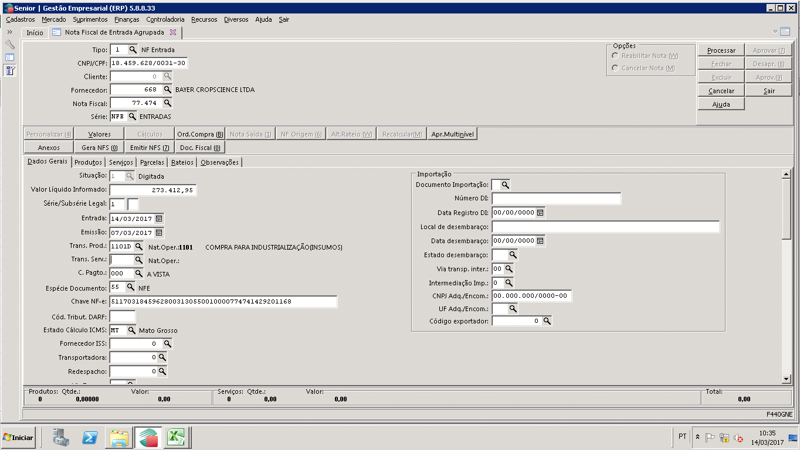

Campo da Tela | Valor
 - | - 
ORD. COMPE | (B)	
FILIAL DA ORDEM | 2
MOSTRAR | - 	
ITENS DA ORDEM DE COMPRA | -	
QTDE. DA NOTA FISCAL | 5.000
PROCESSAR | 
SAIR |   

Campo da Tela | Valor
 - | -
PREÇO UNITÁRIO | 54,68259  

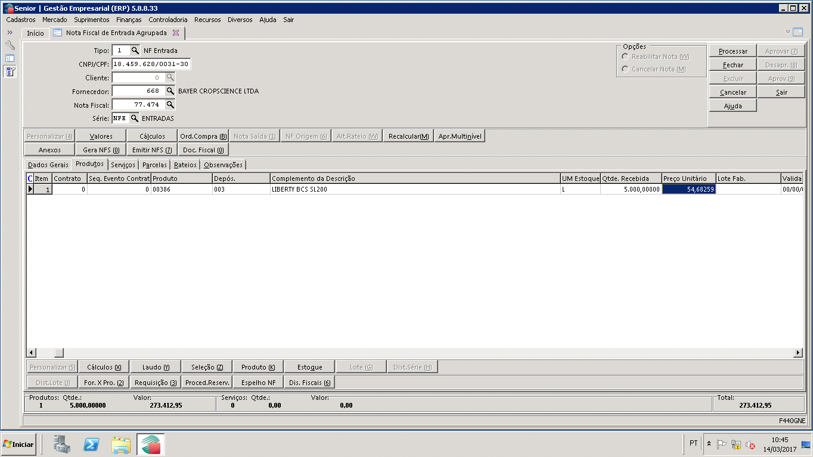  
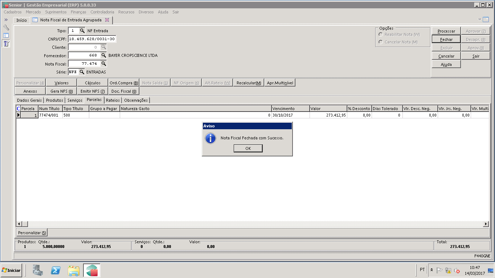

Campo da Tela | Valor
 - | -
CNPJ/CPF | 18.459.628/0031-30
NOTA FISCAL	| 12345
SERIE | 1
VALOR LIQUIDO INFORMADO	| 27.411,61
SERIE | 1
ENTRADA	| 14/03/2017
EMISSAO | 08/03/2017
TRANS. PRODUTO | 1922  

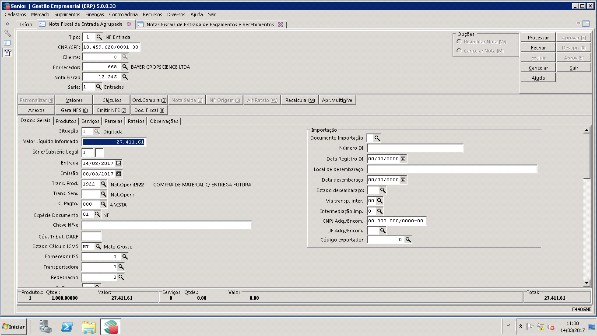  

Campo da Tela | Valor
 - | - 
FILIAL O. COMPRA | 2
MOSTRAR	| 
QTDE NOTA FISCAL | 1.000  

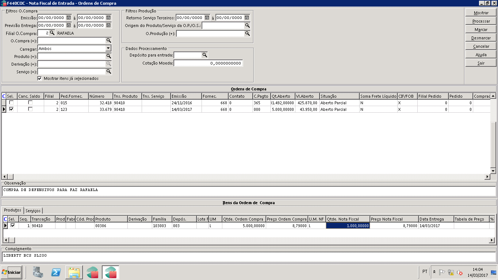  
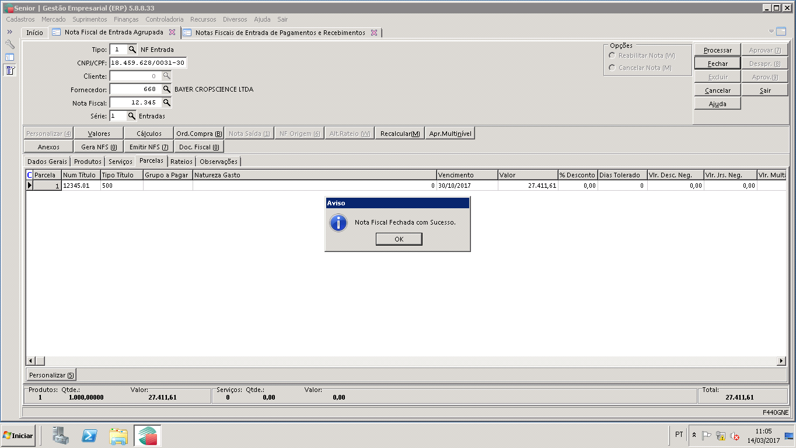  
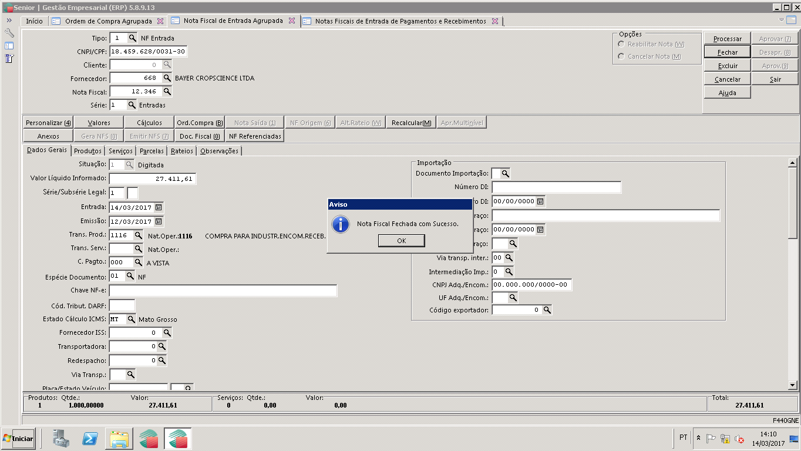

## **F440NPR_SRNF - Suprimentos / Gestão de Recebimento / Notas Fiscais de Entrada / Pagamentos e Recebimentos**

### Notas da Versão 5.8.9.21

!!! note ""
	**Sistema permitia ao usuário que consultasse tela não disponível para ele**  

	**Problema:** era permitido a consulta da tela **Nota Fiscal de Entrada Agrupada - Ajuste de Balança (F440GNE)** pela tela **Consulta de Notas Fiscais de Entrada (F441CNE)**, mesmo que o usuário não possuía acesso na tela **Nota Fiscal de Entrada Agrupada - Ajuste de Balança**.  
	**Correção efetuada:** ajustamos a abrangência de usuários para que seja efetuada a verificação se o usuário possui acesso da tela **Nota Fiscal de Entrada Agrupada - Ajuste de Balança (F440GNE)** nas telas **Consulta de Notas Fiscais de Entrada (F441CNE)**, Via *Recebimento de Documento Eletrônico (F000INE)* e *Recebimento - Nota Fiscal de Entrada de Pagamento e Recebimento (F440NPR)*.

### Teste

Campo da Tela | Valor
 - | -
FORNECEDOR | 668
TRANS PROD. | 1922
SERIE/NF | 1 / 12345
FECHAR NOTA(S) APÓS PROCESSAR	DESMARCAR | - 
MOSTRAR | - 
TRANSAÇÃO DE PRODUTO SUGERIDA PARA A NOTA FISCAL DE RECEBIMENTO NÃO POSSUI INTEGRAÇÃO COM ESTOQUES. DESEJA MANTER A TRANSAÇÃO SUGERIDA? | SIM

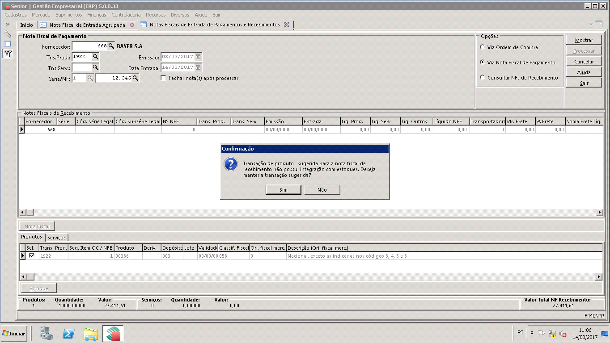

Campo da Tela | Valor
 - | - 
N° NFE | 12346
TRANS. PRODUTO | 1116
Transação de produto do cabeçalho da nota fiscal de recebimento será sugerida para os itens de produto. Deseja continuar? | SIM
EMISSAO | 12/03/2017
ENTRADA	| 14/03/2017
CONFERIR QTDE RECEBIDA | - 	
PROCESSAR | - 

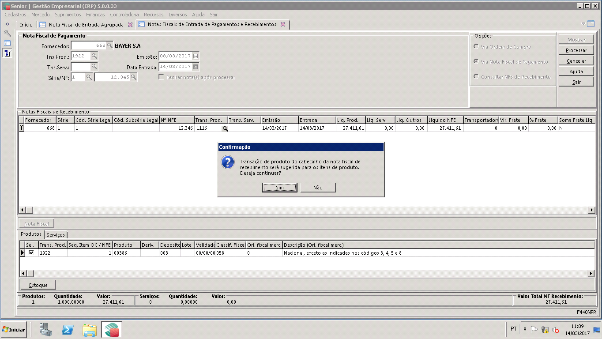  
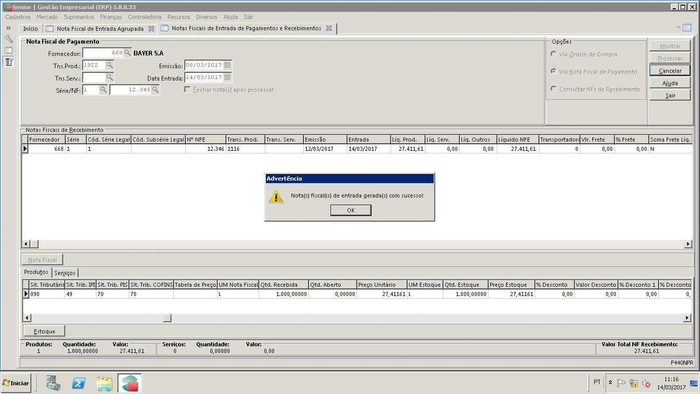

## **F140PRE_RFNF - Mercado / Gestão de Faturamento e Outras Saídas / Notas Fiscais de Saída / Individual (Via Pedidos e Notas Fiscais) - Remessa de Armazenagem**

### Notas da Versão 5.8.9.21

!!! note ""
	**Sistema permitia ao usuário que consultasse tela não disponível para ele**  

	**Problema:** era permitido a consulta da tela **Nota Fiscal de Entrada Agrupada - Ajuste de Balança (F440GNE)** pela tela **Consulta de Notas Fiscais de Entrada (F441CNE)**, mesmo que o usuário não possuía acesso na tela **Nota Fiscal de Entrada Agrupada - Ajuste de Balança**.  
	**Correção efetuada:** ajustamos a abrangência de usuários para que seja efetuada a verificação se o usuário possui acesso da tela **Nota Fiscal de Entrada Agrupada - Ajuste de Balança (F440GNE)** nas telas **Consulta de Notas Fiscais de Entrada (F441CNE)**, *Via Recebimento de Documento Eletrônico (F000INE)* e *Recebimento - Nota Fiscal de Entrada de Pagamento* e *Recebimento (F440NPR)*.

## **F140PRE_RFNF - Mercado / Gestão de Faturamento e Outras Saídas / Notas Fiscais de Saída / Individual (Via Pedidos e Notas Fiscais) - Remessa de Armazenagem**

### Notas da Versão 5.8.8.65

!!! note ""
	**Informação de campo não era gravada na base**  

	**Problema:** ao gerar uma nota fiscal pelas telas **Notas Fiscais de Saída** e **Preparação da Nota Fiscal Saída** com o identificador de regras **VEN-140FRENF01** ativo, passando a regra abaixo:  
	**VSVlrFre = 200;  
	VSPerIcf = 12;  
	VSIcmFre = 24;**  
	A seguinte situação ocorria:  
	**1.**	O campo *Valor Frete (VlrFre)*, da tabela *Vendas - Notas Fiscais de Saída - Dados Gerais (E140NFV)*, gerava corretamente;  
	**2.**	O campo *Percentual de ICMS* sobre o frete da nota fiscal de saída *(PerIcf)*, da tabela *Vendas - Notas Fiscais de Saída - Dados Gerais (E140NFV)*, ficava com o valor zerado;  
	**3.**	O campo *Valor do ICMS* sobre o frete da nota fiscal de saída *(IcmFre)*, da tabela *Vendas - Notas Fiscais de Saída - Dados Gerais (E140NFV)*, gerava corretamente.  
	Além disso, não havia o campo *Base de cálculo do ICMS* sobre o frete da nota fiscal de saída *(VlrBif)*, da tabela *Vendas - Notas Fiscais de Saída - Dados Gerais (E140NFV)*, para ser alimentado no identificador. Porém, ele era necessário para a composição geral das informações.  
	**Correção efetuada:** corrigimos o campo *Percentual de ICMS* sobre o frete da nota fiscal de saída *(PerIcf)* para que ele seja gravado na base corretamente.

### Notas da Versão 5.8.8.68

!!! note ""
	**Mensagem de erro na validação do SPED Contribuições**  

	**Problema:** na validação do *SPED Contribuições* ocorria a seguinte mensagem no registro **C181: Valor informado deve ser maior que zero campo Valor Total do Item.** O problema ocorria, pois uma nota fiscal de complemento de ICMS, NF de saída tipo 9, era listada no *SPED Contribuições*, e nessa nota fiscal só existia o valor do ICMS preenchido.  
	**Correção efetuada:** ajustamos a geração de nota fiscal de saída do tipo *Acerto* para que não obrigue ao usuário informar as *CST de ICMS, IPI, PIS e COFINS* quando for executada a regra **522**.  
	Ajustamos também, a geração de nota fiscal de entrada do tipo *Acerto/complemento* para que não obrigue ao usuário informar as *CST de ICMS, IPI, PIS e COFINS* quando for executada a regra **514**. Alteramos as regras **519** e **559** para não obrigarem a situação tributária de ICMS das notas de *Acerto*.

### Notas da Versão 5.8.9.14

!!! note ""
	**Informação de campo não era gravada na base**  

	**Problema:** ao gerar uma nota fiscal pelas telas **Notas Fiscais de Saída** e **Preparação da Nota Fiscal Saída** com o identificador de regras **VEN-140FRENF01** ativo, passando a regra abaixo:  
	**VSVlrFre = 200;  
	VSPerIcf = 12;  
	VSIcmFre = 24;**  
	A seguinte situação ocorria:  
	**4.**	O campo *Valor Frete (VlrFre)*, da tabela *Vendas - Notas Fiscais de Saída - Dados Gerais (E140NFV)*, gerava corretamente;
	**5.**	O campo *Percentual de ICMS* sobre o frete da nota fiscal de saída *(PerIcf)*, da tabela *Vendas - Notas Fiscais de Saída - Dados Gerais (E140NFV)*, ficava com o valor zerado;  
	**6.**	O campo *Valor do ICMS* sobre o frete da nota fiscal de saída *(IcmFre)*, da tabela *Vendas - Notas Fiscais de Saída - Dados Gerais (E140NFV)*, gerava corretamente.  
	Além disso, não havia o campo *Base de cálculo do ICMS* sobre o frete da nota fiscal de saída *(VlrBif)*, da tabela *Vendas - Notas Fiscais de Saída - Dados Gerais (E140NFV)*, para ser alimentado no identificador. Porém, ele era necessário para a composição geral das informações.  
	**Correção efetuada:** corrigimos o campo *Percentual de ICMS* sobre o frete da nota fiscal de saída *(PerIcf)* para que ele seja gravado na base corretamente.

### Notas da Versão 5.8.9.19

!!! note ""
	**Reserva no estoque não era atualizada ao faturar pedido**  

	**Problema:** ao faturar um pedido, a reserva do pedido era duplicada para a nota. Causando, assim, divergência nas reservas.  
	**Correção efetuada:** corrigimos a rotina de geração da nota fiscal para que a reserva do pedido seja transferida para a nota fiscal, de forma que a reserva não fique duplicada.

### Notas da Versão 5.8.9.20

!!! note ""
	**Nota fiscal do tipo devolução não carregava tag *vIPIDevol***  

	**Problema:** o valor da tag *<vIPIDevol>* não era carregado no XML emitido em notas fiscais do tipo 3 - *Devolução (NF Saída)*.  
	**Correção efetuada:** ajustamos a tela **Nota Fiscal de Entrada Agrupada** para que notas fiscais do tipo 3 - *Devolução (NF Saída)*, que possuem finalidade 4 - *Devoluções/Retorno*, carreguem o valor para a tag *<vIPIDevol>*, quando a nota possuir valor de *IPI*.

	**Percentual de IPI aplicado indevidamente**  

	**Problema:** ao efetuar a entrada de uma nota fiscal onde o fornecedor era indústria, possuía tributação de IPI em todos os pontos (fornecedor, transação, produto), mas não recuperava IPI, a alíquota de *IPI Creditado Efetivamente* era atribuído de forma automática.  
	**Correção efetuada:** ajustamos o comportamento da tela para que a alíquota de *IPI Creditado Efetivamente* não seja carregada de forma automática quando inserido o *%IPI*.

	**Identificador de regra executado indevidamente**  

	**Problema:** ao efetuar o lançamento de uma nota fiscal de entrada vinculada à nota fiscal de saída através botão *Nota Saída*, o identificador de regra **CPR-440TNSDE01** era acionado mais vezes que o necessário, sendo que na última chamada as variáveis *TnsPns, TnsSns, TsiPns, TsiSns* retornavam sem valor, ocasionando problema caso utilizasse essas variáveis na regra.  
	**Correção efetuada:** ajustamos a tela de **Nota Fiscal de Entrada Agrupada** para que ao sair da tela **Nota Saída**, o identificador não seja executado novamente.

	**Erro na ligação da ordem de compra com nota fiscal**  

	**Problema:** quando consultada uma ordem de compra com parcelas especiais para ligá-la a uma nota fiscal, através do botão *Ord. Compra*, caso esta ordem de compra possuísse mais parcelas que a condição de pagamento, ela não era apresentada na tela.  
	**Correção efetuada:** ajustamos a rotina de ligação de ordem de compra com nota fiscal para que, quando consultada uma ordem de compra que possui parcelas especiais e mais parcelas que a condição de pagamento da série da nota fiscal, seja apresentado o motivo no log.

### Notas da Versão 5.8.9.21

!!! note ""
	**Diferencial de alíquota não calculado nas notas do tipo 1 - *Normal***  

	**Problema:** o valor do diferencial de alíquota não era calculado nas notas fiscais de entrada do tipo 1 - *Normal*, quando a *Aplicação da Natureza da Operação* da transação fosse igual a *F - Transporte*.  
	**Correção efetuada:** ajustamos a tela de notas fiscais para que o valor do diferencial de alíquota seja calculado quando a nota fiscal de entrada for do tipo 1- *Normal* e a natureza de operação for de transporte, pois o comportamento de cálculo do diferencial de alíquota deve ser semelhante ao da nota de entrada de frete, tipo 8- *NF Frete/Serviços Agregados*.

	**Conversão de unidade de medida na nota fiscal**  

	**Problema:** ao alterar o campo *UM Fiscal* na tela de **Nota Fiscal de Entrada**, guia *Produtos*, não era apresentada a pergunta sobre conversão de unidades de medida e a conversão não ocorria.  
	**Correção efetuada:** ajustamos a tela para que, ao alterar o campo *UM Fiscal*, o campo *UM Nota Fiscal* também seja alterado, apresentando assim a mensagem de conversão de unidade de medida nestes casos.

	**Alíquotas de *PIS/COFINS* zeradas em carregadas**  

	**Problema:** ao ligar uma nota fiscal de frete a uma nota fiscal de origem na tela **Nota Fiscal de Entrada Agrupada**, botão *NF Origem (6)*, quando fosse carregado o *PIS/COFINS* da nota de origem para a nota de frete *(parâmetro Considera Parâmetros das Origens NF Frete)*, não carregava as alíquotas, mantendo elas zeradas.  
	**Correção efetuada:** ajustamos a tela **Nota Fiscal de Entrada Agrupada** para que ao carregar os parâmetros da nota fiscal de origem para a nota fiscal de frete, sejam carregas as alíquotas corretamente do *PIS/COFINS*.

	**Erro no fechamento da nota fiscal do tipo 10 - *NF Acerto***  

	**Problema:** a tela **Notas Fiscais de Entrada Agrupada** não permitia fechar uma nota do tipo 10 - *NF Acerto (NF Saída)* sem transação de serviço e de produto informada nas definições do fornecedor, mesmo que a nota estivesse tratando somente item de produto.  
	**Correção efetuada:** ajustamos a situação para que, quando a regra **CPR-440TNSDE01** estiver ligada e não estiver tratando a transação (produto e serviço) informada, seja possível realizar o fechamento da nota fiscal mesmo assim.

	**Sugestão de lote não carregava valor para a variável *EstACodPro***  

	**Problema:** na geração da nota fiscal de entrada, ao inserir um item de produto controlado por lote efetuando posteriormente a sugestão de lotes, na tela de distribuição, chamada através do botão *Sugere Lotes*, é chamada a regra, porém a variável *EstACodPro* não recebia valor e consequentemente não sugeria os lotes. Na sequência era apresentada a mensagem: **É necessário que a variável *EstACodLot* esteja declarada na regra - Identificador GER-000SULOT01.**  
	**Correção efetuada:** ajustamos a rotina para que na execução do identificador de rega **GER-000SULOT01**, as variáveis *EstACodPro*, *EstACodDer* e *EstACodDep* sejam carregadas corretamente.

	**Chave eletrônica não era exibida por completo**  

	**Problema:** o campo *Chave da Nota Fiscal do Produtor Eletrônica* da tela **Documento Fiscal Produtor Rural (F440RNP)** era exibido de maneira incompleta.  
	**Correção efetuada:** ajustamos o campo *Chave da Nota Fiscal do Produtor Eletrônica* da tela **Documento Fiscal Produtor Rural** para que seja exibida a chave eletrônica por completo.

	**Sistema permitia ao usuário que consultasse tela não disponível para ele**  

	**Problema:** era permitido a consulta da tela **Nota Fiscal de Entrada Agrupada - Ajuste de Balança (F440GNE)** pela tela **Consulta de Notas Fiscais de Entrada (F441CNE)**, mesmo que o usuário não possuía acesso na tela **Nota Fiscal de Entrada Agrupada - Ajuste de Balança.**  
	**Correção efetuada:** ajustamos a abrangência de usuários para que seja efetuada a verificação se o usuário possui acesso da tela **Nota Fiscal de Entrada Agrupada - Ajuste de Balança (F440GNE)** nas telas **Consulta de Notas Fiscais de Entrada (F441CNE)**, *Via Recebimento de Documento Eletrônico (F000INE)* e **Recebimento - Nota Fiscal de Entrada de Pagamento** e **Recebimento (F440NPR)**.

	**Mensagem indevida ao sugerir lotes**  

	**Problema:** a mensagem: **Não acessou a *Tabela de Produtos*** era apresentada indevidamente ao acessar a tela **Distribuição Produto por Lote**, através do botão *Sugere Lotes*.  
	**Correção efetuada:** ajustamos a tela para que a mensagem seja apresentada apenas quando realmente houver um problema na tabela de produto.

### Notas da Versão 5.8.9.23

!!! note ""
	**Chave da nota fiscal eletrônica de produtor**  

	Agora será possível informar a chave da nota fiscal eletrônica de produtor na Fixação de preços, na *Devolução de Produtos* (para cobrança de taxas em produto) e na *Transferência entre produtores*. Esta nota deverá ser preenchida através da chave, no campo *Chave NFP-e*. A nota fiscal de produtor eletrônica será referenciada na nota fiscal de compra gerada pela fixação, devolução ou transferência, no campo *chvnfp* da tabela *E440DPR*. A chave da nota fiscal pode ser consultada/alterada através da nota fiscal de compra, na tela de **Nota Fiscal de Entrada Agrupada (F440GNE)**, botão *NFP* referenciada *(F440RNP)*, campo *Chave da Nota Fiscal do Produtor Eletrônica*.

	**Cálculo de impostos de importação atendendo ao processo de Admissão Temporária**  

	A admissão temporária prevista na *IN 1600/2015* afirma que na importação de produtos, os valores dos tributos federais podem ser calculados proporcionais ao tempo de permanência do produto no território aduaneiro ou podem ter a suspensão total dos impostos.  
	Os impostos federais que esta legislação trata são:  
	**•	Imposto de Importação  
	•	IPI de Importação  
	•	PIS de Importação  
	•	Cofins de Importação  
	•	CIDE combustíveis  
	•	AFRMM**  
	O *ERP* permite configurar o cálculo do valor da base destes impostos, com base do tempo de permanência do produto na aduaneira. Esta configuração é realizada por produto e por imposto, para notas fiscais do tipo 7 (Geração Manual).  
	Veja detalhes na documentação do processo de *Admissão Temporária*.

	**Atendimento à *Normativa CAT 06/2015***  

	No estado de São Paulo, conforme a Decisão *Normativa CAT 06/2015*, os valores do seguro e do frete não devem ser destacados nos campos próprios da nota fiscal de importação, porque esses valores compõem o valor aduaneiro, que por sua vez é o preço unitário, ou seja, os valores do frete e seguro devem compor o preço unitário.  
	Para atender esta necessidade, criamos o campo *Soma Frete* e *Seguro Importação* valor unitário itens na tela **Parâmetros da Filial** para *Compras* onde:  
	**•**	caso for selecionada a opção *S - Sim* , ao processar a tela **Nota Fiscal de Entrada - Valores Diversos (F440VAL)**, acessada através do botão *Valores* da tela **Nota Fiscal de Entrada Agrupada**, e calcular os rateios do frete e seguro importação, os valores calculados serão incorporados ao preço unitário dos itens e os valores dos campos *Valor Frete Importação* e *Valor Seguros Importação* ficam zerados (no item e nos dados gerais).  
	**Exemplo:**  
	Nota fiscal de importação (NF tipo 7) conforme abaixo:  
	**o	Item 1 - Preço Unitário: R$ 50,00  
	o	Item 2 - Preço Unitário: R$ 100,00  
	o	Frete Importação: R$ 15,00  
	o	Seguro Importação: R$ 25,00**  
	Valor unitário após o rateio:  
	**o	Item 1 - Preço Unitário: R$ 63,33 (Esse valor é 50 (preço unitário) + 5 (VlrFei) + 8,33 (VlrSei))  
	o	Item 2 - Preço Unitário: R$ 126,67 (Esse valor é 100 (preço unitário) + 10 (VlrFei) + 16,67 (VlrSei))  
	o	Frete Importação: 0  
	o	Seguro Importação: 0  
	•	caso for selecionada a opção N - Não, ao informar o seguro e o frete nos campos Valor Frete Importação e Valor Seguros Importação da tela Nota Fiscal de Entrada - Valores Diversos (F440VAL), o sistema realiza o rateio para os itens (F440GNE).**  

	**Deduzir ICMS do valor base de PIS e COFINS**  

	Agora será possível deduzir o valor de ICMS da base de *PIS e COFINS*, nas notas fiscais de compra. Essa implementação ocorreu para adequar-se ao julgamento do *STF do RE 240.785*.  
	**Exemplo**  
	A parametrização deve ser feita de acordo com a transação da nota fiscal, cadastrada na tela de **Transações de Compra (F001TDC)**, nos campos:  
	**•	Guia PIS, Descontar ICMS da base do PIS.  
	•	Guia COFINS, Descontar ICMS da base do COFINS.**  
	Para esta implementação adicionamos também o campo *Tipo de Operação* na tela de **Transações de Compra (F001TDC)**, este campo serve para identificar o tipo de operação da transação: se ela será de *Pagamento*, *Recebimento* ou *Normal*. A inicialização deste campo para as transações já existentes na base de dados será igual a *N-Normal*.  
	É possível que uma *Nota Fiscal de Entrada* do tipo *Pagamento* não calcule o ICMS. Nestes casos, o sistema faz uma simulação do cálculo do ICMS e o desconta do valor base de *PIS e COFINS*. O valor da simulação do cálculo pode ser consultado no campo ICMS para entrega futura - Base/Valor, através da tela de **Nota Fiscal de Entrada Agrupada (F440GNE)**, botões *Cálculo*.  
	Veja detalhes na documentação do processo em *Redução do ICMS* na base de *PIS / COFINS*.

	**Tipo da base de cálculo do *DIFAL* era diferente de 2 - *Simples***  

	**Problema:** na tela **Nota Fiscal de Entrada Agrupada**, ao gerar uma nota fiscal de entrada do tipo 8 - *Frete/Serviços Agregados*, o tipo da base de cálculo do *DIFAL* utilizado era diferente de 2 - *Simples*. Era verificado no cadastro da filial, porém para o estado de Minas Gerais existia essa exceção.  
	**Correção efetuada:** ajustamos as notas fiscais de entrada de frete, quando a filial residente for do estado de Minas Gerais, para que o sistema calcule o diferencial de alíquota utilizando como tipo de base de cálculo o modelo 2 - *Simples*.

	**Não era possível reabilitar uma nota de entrada de retorno**  

	**Problema:** não era possível reabilitar uma nota de entrada (retorno), quando existia uma nota de saída ligada a ela, mesmo que essa nota de saída já estivesse totalmente devolvida.  
	**Correção efetuada:** corrigimos a rotina para que seja possível reabilitar a *NF-e* quando a *NFV* estiver totalmente devolvida.

	**Erro ao vincular uma ordem de compra em mais de uma nota fiscal**  

	**Problema:** ao vincular uma ordem de compra em mais de uma nota fiscal, o sistema não fazia corretamente a consistência de quantidade disponível na ordem de compra.  
	**Correção efetuada:** ajustamos a consistência de quantidade aberta de ordem de compra, quando o parâmetro *Permite* ligar item OC em sit. 8 à NF de ent. estiver ativo no cadastro da empresa.

### Teste

Campo da Tela | Valor
 - | -  
TIPO | 4  
SERIE |  NFS (AUTOMATICO)  
CLIENTE	| 6551  
REGRA 103: NÃO EXISTE TRANSAÇÃO PRÉ-DEFINIDA COMO SUGESTÃO PARA A NOTA FISCAL ATUAL | OK  

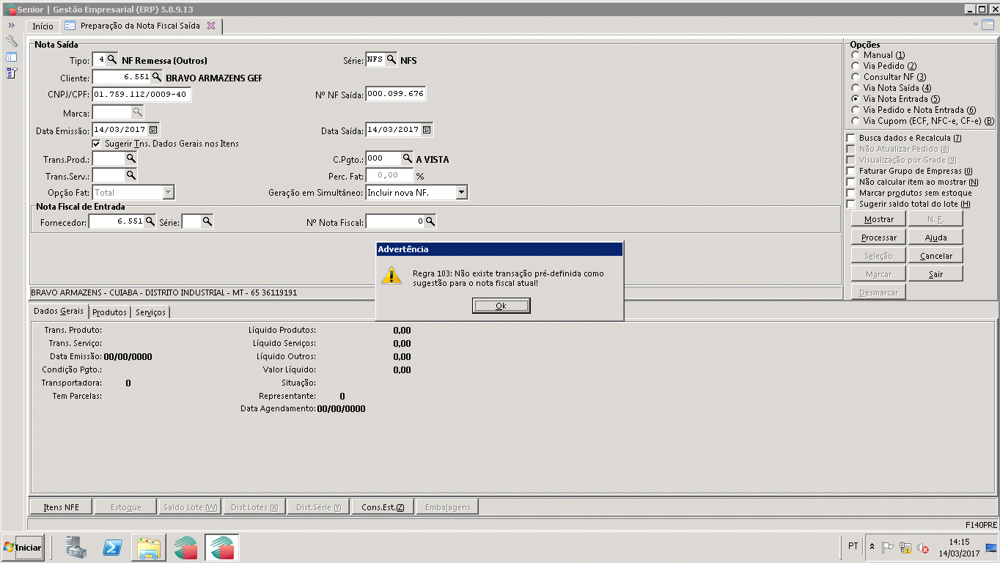

Campo da Tela | Valor
 - | - 
N° NF SAIDA | 99676 (N° AUTOMATICO)
TRANS.PROD. | 5934 
NOTA FISCAL DE ENTRADA | -  	
FORNENEDOR | 668  
SERIE | NFE  
N° NOTA FISCAL | 77474  
MOSTAR | -  

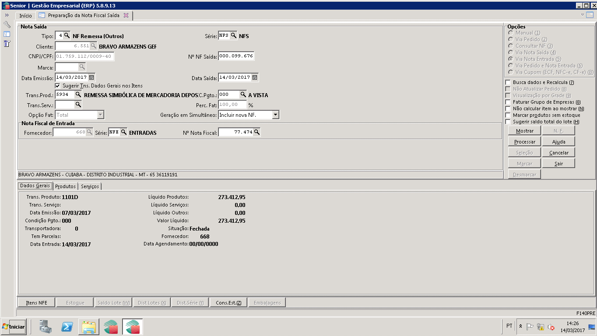

Campo da Tela | Valor
 - | - 
PRODUTO | MARCAR
Não será criado vínculo entre as notas fiscais, a nota fiscal de entrada não terá a quantidade devolvida atualizada. Continuar? | SIM
Confirma Transferência dos Itens? | SIM
Transferência realizada com sucesso. Deseja fechar Nota Fiscal? | NÃO
IR EM N.F | -

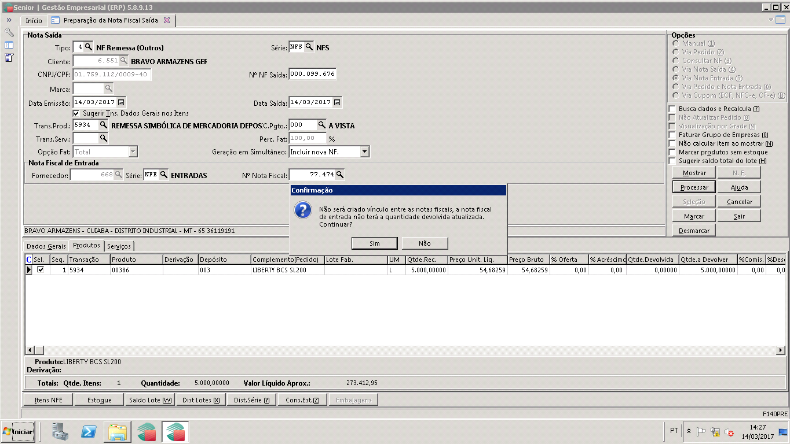
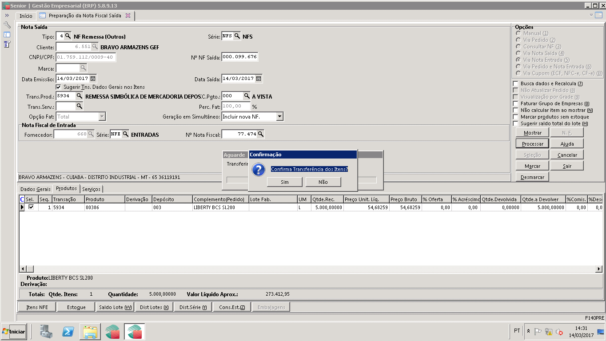
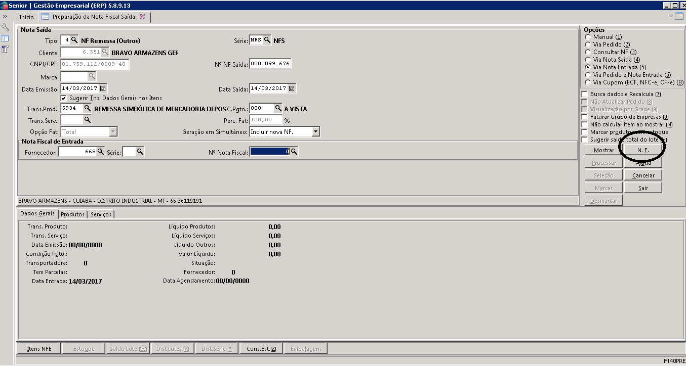

PRODUTO -> VAI PUXAR PRODUTOS DE ACORDO COM A NF DE ENTRADA 77474.

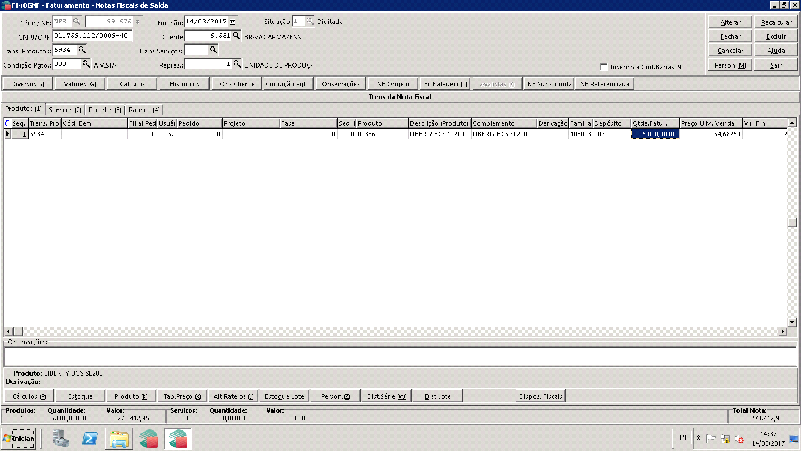

DIVERSOS | -
- | -  	
OBSERVAÇÃO DA NOTA | REMESSA DE ARMAZENGEM DA BAYER REF A NF 77.474 – LIBERTY SL200 2X10L – LOTE 052/16 QUANT. 5.000 LTS

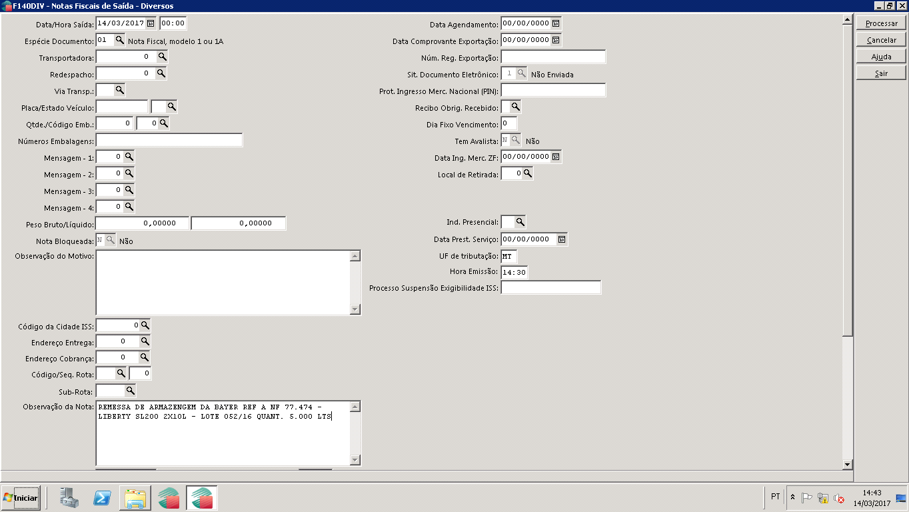

Hora de emissão não pode ser maior que hora de saída  ->	VOU TER QUE ALTERAR MANUAL PARA PODER PROCESSAR 

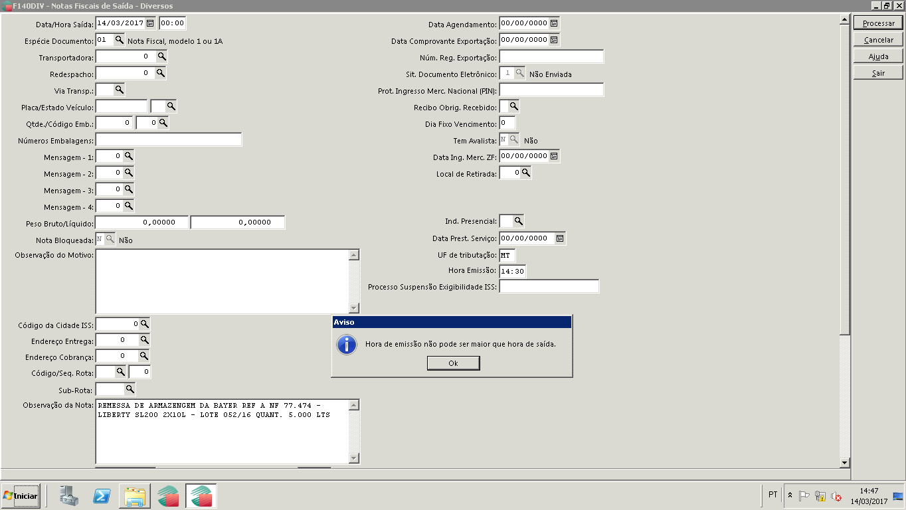  
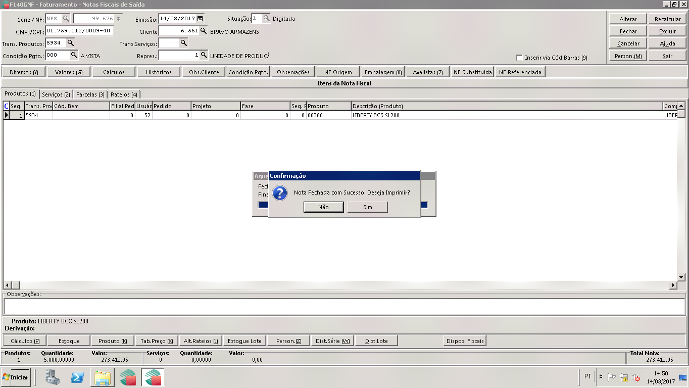

## **F440GNE _SRNF – Suprimentos / Gestão de Recebimento / Notas Fiscais de Entrada / Agrupada – Retorno de Armazenagem**

### Notas da Versão 5.8.8.67

!!! note ""
	**Chave da nota fiscal eletrônica de produtor**  

	O produtor pessoa física ou jurídica pode emitir uma nota fiscal eletrônica do produtor, essa nota fiscal poderá ser informada no sistema, quando o processo gera uma nota fiscal do tipo 6. O campo que receberá essa informação é o *Chave NPF-e*, implementado nas telas de **Manutenção de Ticket, Compras - Controle de Entradas** e *Saídas (Via Contrato de Classificação)**, na guia *Fornecedores Participantes*.
	No web service **com.senior.g5.co.mcm.cpr.pesagemviabalancacontrato**, porta **GravaPesagemEntrada 2** inserimos os seguintes campos:  
	**•	ChvNfp: Chave NFP-e  
	•	SnfPro: Série da nota do produtor  
	•	TnsPro: Transação de produto**  

	Disponibilizamos a subtela **Documento Fiscal Produtor Rural (F440RNP)**, acessada pelo botão *NFP Referenciada* da tela de **Nota Fiscal de Entrada Agrupada**. Esta subtela permite alterar informações da *Nota do Produtor*. Assim, caso haja rejeição da nota, será possível alterar os dados.

	Se houver preenchimento na *Chave NPF-e*, no xml gerado da nota a tag *<refNFe>* será preenchida com *NFP-e*.

	**Novo identificador de regras *CPR-440PRMED02***  

	Criamos o identificador de regras **CPR-440PRMED02** que tem por objetivo permitir utilizar o preço médio do produto, informado via regra, em vez do valor líquido do item na valorização dos produtos na tela **Valorização do Produto (F440VPR)**.

	**O sistema não atualizava a transação de produto e/ou serviço e natureza da operação**  

	**Problema:** na tela **Nota Fiscal de Entrada Agrupada**, ao dar entrada em notas do tipo *2, 3 e 10* utilizando o parâmetro global **UsaEntOri** ativo ao alterar a origem da mercadoria, para um endereço de fora do estado da filial, o sistema não atualizava a transação de produto e/ou serviço, assim como também não atualizava a natureza da operação.  
	**Correção efetuada:** ajustamos o sistema para que ao alterar a origem da mercadoria para um endereço de fora do estado da filial, o sistema faça a busca da transação e natureza da operação correspondentes para aquele determinado fornecedor.

	**Mensagem de erro ao informar uma nota de frete**  

	**Problema:** no vínculo de uma nota de frete com uma nota de origem através do botão *NF Origem (6)*, onde a nota de frete possuía o estado para cálculo do ICMS como PR e o fornecedor realizava o cálculo em outro estado, como SC, retornava uma mensagem de recálculo da nota: **O Estado PR para o cálculo da alíquota de ICMS do conhecimento de frete difere do Estado SC da Nota Fiscal de Origem 1988. Deseja recalcular a Nota Fiscal?.**  
	O sistema ignorava que o estado para o cálculo do ICMS da nota de origem era PR e apresentava o número da nota de frete em vez do número da nota de origem. Isso ocorria quando o parâmetro global *UsaEntOri* estava como *S-Sim*, pois existia uma mudança na nota fiscal por conta deste parâmetro (busca dos dados da origem de mercadoria) que não verificava esta mudança.  
	**Correção efetuada:** ajustamos a mensagem do recálculo do ICMS para que os estados utilizados para o cálculo do ICMS sejam os da nota de frete e da nota de origem quando o parâmetro global *UsaEntOri* for *S-Sim*, quando esse parâmetro for *N-Não*, o estado utilizado continuará a ser do fornecedor para a nota de entrada e do cliente para a nota de saída.  
	Ajustamos o sistema também, para apresentar o número da nota de origem em vez da nota de frete na mensagem de recálculo.

	**Campo Código Especificador da Substituição Tributária não era carregado**  

	**Problema:** ao vincular uma ordem de compra a uma nota fiscal de entrada na tela **Nota Fiscal de Entrada Agrupada**, o campo *Código Especificador da Substituição Tributária* dos itens da nota fiscal de entrada não era carregado.  
	**Correção efetuada:** ajustamos o campo *Código Especificador da Substituição Tributária* para que carregue as parametrizações do sistema, ao vincular uma ordem de compra a uma nota fiscal de entrada. Diferente da nota fiscal de saída, o campo *Código Especificador da Substituição Tributária* não está presente na tabela dos itens da ordem de compra, portanto não terá herança.

	**Erro ao realizar o lançamento de uma nota fiscal de entrada a partir de uma ordem de compra que possuía produtos KIT**  
	
	**Problema:** ao realizar o lançamento de uma nota fiscal de entrada a partir de uma ordem de compra que possuía produtos *KIT*, caso a transação do item de produto da nota fiscal não tinha integração com estoque, o sistema não permitia mais reabilitação e cancelamento dessa nota, apresentando a mensagem Não foi possível localizar os *Movimentos de Estoque* gerados pela *Nota Fiscal* (Produtos KIT da Ordem de Compra), porém no fechamento da nota não era validada essa informação.  
	**Correção efetuada:** ajustamos a rotina de fechamento da nota fiscal de entrada, apresentando a seguinte mensagem ao tentar fechar uma nota fiscal de entrada com produto *KIT* de ordem de compra, em que a transação do item de produto esteja sem integração com estoque: *Ordem de Compra possui Produtos KIT*. Necessário que a transação do item de produto da *Nota Fiscal* tenha integração com *Estoque!*.

	**Era possível alterar o campo *Produto do primeiro registro* na guia *Produtos***  
	
	**Problema:** quando gerada uma nota fiscal vinculada a uma ordem de compra ou uma nota fiscal de venda, ao consulta-la na tela **Nota Fiscal Agrupada** era possível alterar o campo *Produto do primeiro registro* na guia *Produtos*.  
	**Correção efetuada:** ajustamos a tela **Nota Fiscal Agrupada** para que caso a nota fiscal possua um vínculo com uma ordem de compra ou uma nota fiscal de venda, não seja possível alterar o registro do primeiro produto na guia *Produtos*.

### Notas da Versão 5.8.8.68

!!! note ""
	**Mensagem de erro na validação do *SPED Contribuições***  

	**Problema:** na validação do *SPED Contribuições* ocorria a seguinte mensagem no registro *C181:* **Valor informado deve ser maior que zero campo Valor Total do Item.** O problema ocorria, pois uma nota fiscal de complemento de ICMS, NF de saída tipo 9, era listada no *SPED Contribuições*, e nessa nota fiscal só existia o valor do ICMS preenchido.  
	**Correção efetuada:** ajustamos a geração de nota fiscal de saída do tipo *Acerto* para que não obrigue ao usuário informar as *CST de ICMS, IPI, PIS e COFINS* quando for executada a regra **522**.  
	Ajustamos também, a geração de nota fiscal de entrada do tipo *Acerto/complemento* para que não obrigue ao usuário informar as *CST de ICMS, IPI, PIS e COFINS* quando for executada a regra **514**. Alteramos as regras **519** e **559** para não obrigarem a situação tributária de ICMS das notas de Acerto.

### Notas da Versão 5.8.9.17

!!! note ""
	**Mensagem de erro na validação do *SPED Contribuições***  

	**Problema:** na validação do *SPED Contribuições* ocorria a seguinte mensagem no registro *C181*: **Valor informado deve ser maior que zero campo Valor Total do Item.** O problema ocorria, pois uma nota fiscal de complemento de ICMS, NF de saída tipo 9, era listada no *SPED Contribuições*, e nessa nota fiscal só existia o valor do ICMS preenchido.  
	**Correção efetuada:** ajustamos a geração de nota fiscal de saída do tipo *Acerto* para que não obrigue ao usuário informar as *CST de ICMS, IPI, PIS e COFINS* quando for executada a regra **522**.  
	Ajustamos também, a geração de nota fiscal de entrada do tipo *Acerto/complemento* para que não obrigue ao usuário informar as *CST de ICMS, IPI, PIS e COFINS* quando for executada a regra **514**. Alteramos as regras **519** e **559** para não obrigarem a situação tributária de ICMS das notas de Acerto.

### Notas da Versão 5.8.9.18

!!! note ""
	**Situação da nota não era alterada**  

	**Problema:** ao processar uma nota importada na tela **Via Recebimento de Documento Eletrônico (F000INE)** era gerada uma nota fiscal e ao realizar o cancelamento desta nota na tela **Nota Fiscal de Entrada Agrupada**, através da opção *Cancelar Nota (M)* não era alterada a situação da nota importada, deixando-a com situação *Processada*.  
	**Correção efetuada:** ajustamos o sistema para que quando o usuário realizar o cancelamento de uma nota fiscal via opção *Cancelar Nota (M)*, caso houver uma nota importada ligada à nota fiscal irá alterar a sua situação de *Processada* para *Pendente*.

	**Lentidão ao utilizar o sistema em outro idioma**  

	**Problema:** ao utilizar o sistema no idioma *Espanhol*, o sistema apresentava lentidão na abertura do sistema, abertura de telas e navegação em campos na grade.  
	**Correção efetuada:** ajustamos a tradução do sistema, melhorando assim a performance.

	**Botão *Personalizar* ficava habilitado antes da nota ser processada**  

	**Problema:** ao gerar uma nota fiscal do tipo 2 - *Devolução*, a tela **Nota Fiscal Entrada Agrupada** deixava o botão *Personalizar* habilitado antes da nota ser processada.  
	**Correção efetuada:** ajustamos a tela **Nota Fiscal Entrada Agrupada** para que o botão *Personalizar* somente fique habilitado após o processamento da nota fiscal.

### Notas da Versão 5.8.9.19

!!! note ""
	**Descrição do serviço na ordem de compra não era indicado**  

	**Problema:** a descrição do complemento do serviço na ordem de compra gerada através da produção não era indicada, gerando dificuldades para entender qual serviço deve ser realizado.  
	**Correção efetuada:** disponibilizamos o identificador de regras **PCP-900PDOCS01** para que a descrição do produto ou serviço seja impressa no complemento do item da ordem de compra.

### Notas da Versão 5.8.9.20

!!! note ""
	**Nota fiscal do tipo devolução não carregava tag *vIPIDevol***  

	**Problema:** o valor da tag *<vIPIDevol>* não era carregado no XML emitido em notas fiscais do tipo 3 - *Devolução (NF Saída)*.  
	**Correção efetuada:** ajustamos a tela **Nota Fiscal de Entrada Agrupada** para que notas fiscais do tipo 3 - *Devolução (NF Saída)*, que possuem finalidade 4 - *Devoluções/Retorno*, carreguem o valor para a tag *<vIPIDevol>*, quando a nota possuir valor de *IPI*.

	**Percentual de IPI aplicado indevidamente**  

	**Problema:** ao efetuar a entrada de uma nota fiscal onde o fornecedor era indústria, possuía tributação de IPI em todos os pontos (fornecedor, transação, produto), mas não recuperava IPI, a alíquota de *IPI Creditado Efetivamente* era atribuído de forma automática.  
	**Correção efetuada:** ajustamos o comportamento da tela para que a alíquota de *IPI Creditado Efetivamente* não seja carregada de forma automática quando inserido o *%IPI*.

	**Erro na ligação da ordem de compra com nota fiscal**  

	**Problema:** quando consultada uma ordem de compra com parcelas especiais para ligá-la a uma nota fiscal, através do botão *Ord. Compra*, caso esta ordem de compra possuísse mais parcelas que a condição de pagamento, ela não era apresentada na tela.  
	**Correção efetuada:** ajustamos a rotina de ligação de ordem de compra com nota fiscal para que, quando consultada uma ordem de compra que possui parcelas especiais e mais parcelas que a condição de pagamento da série da nota fiscal, seja apresentado o motivo no log.

### Notas da Versão 5.8.9.21

!!! note ""
	**Percentual de ICMS interestadual não considerado na ordem de compra**  

	**Problema:** a ordem de compra gerada através da tela **Ordem de Compra Agrupada** não considerava o campo *% ICMS* interestadual *Operações Importação*, conforme configurado nos *Parâmetros por Estado (F009PPE)*, para a redução da base de cálculo do diferencial de alíquota quando o fornecedor era do simples nacional.  
	**Correção efetuada:** ajustamos a tela para que o *Percentual de ICMS* interestadual para operações com produtos importados seja considerado para redução de base de cálculo do diferencial de alíquota nas ordens de compra.

### Teste

Campo da Tela | Valor
 - | - 
TIPO | 5(RETORNO)  
CLIENTE | 6551  
NOTA FISCAL	| 1234  
SERIE | 1  
VALOR LIQUIDO INFORMADO	| 273.412,95  
SERIE/SUBSERIE | 1  
ENTRADA | 14/03/2017  
EMISSÃO	| 14/03/2017  
TRANS. PROD	| 1906  
NOTA SAIDA (1) 

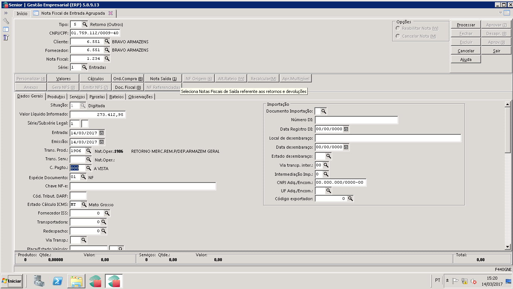

Campo da Tela | Valor
 - | -  
NOTA FISCAL SAÍDA | 99.676  
MOSTRAR | -    
MARCAR | -    
PROCESSAR | -    
Deseja substituir a mensagem 1 da transação da nota de entrada pela mensagem 1 da transação da nota de saída? | SIM  
SAIR | -   
PRODUTO | IR EM PRODUTO PARA VALIDAR  
FECHAR | -   
Deseja chamar rotina de valorização do produto? | NAO  
NOTA FISCAL FECHADA COM SUCESSO | -   

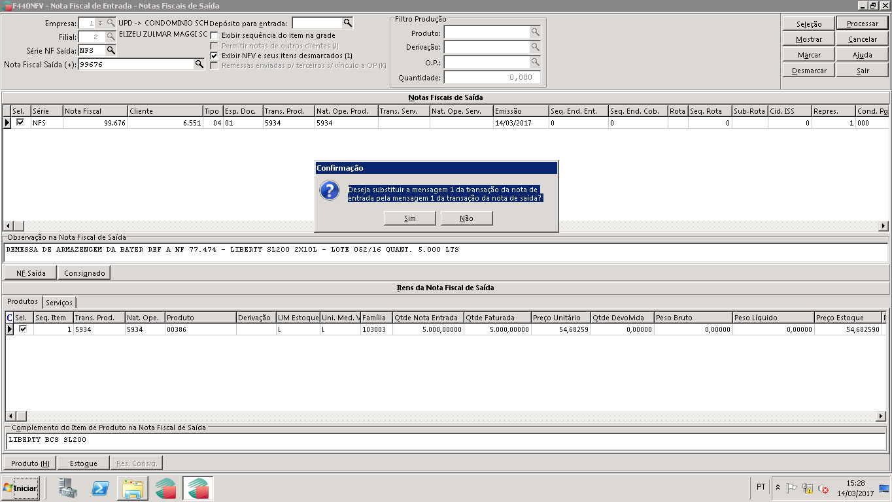  
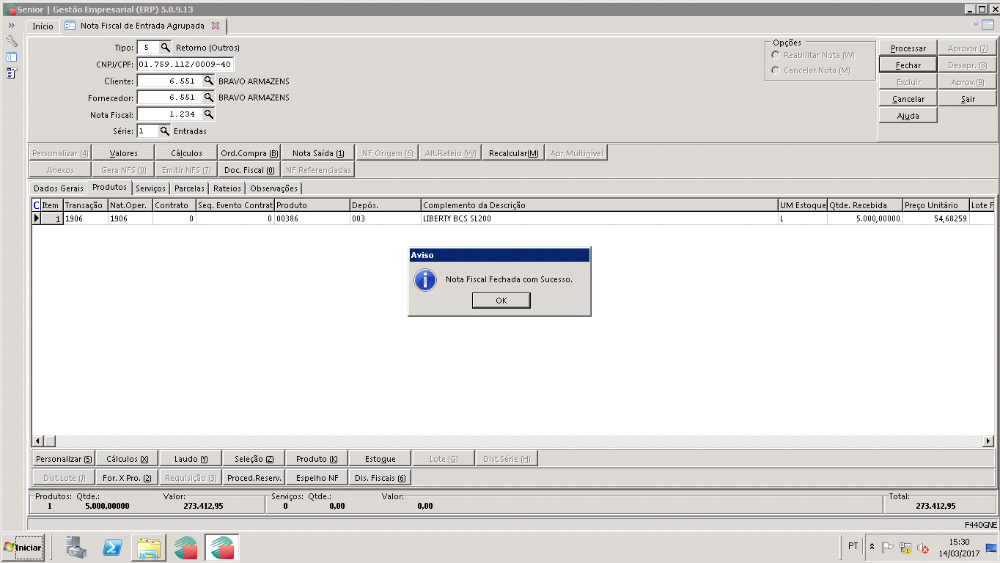